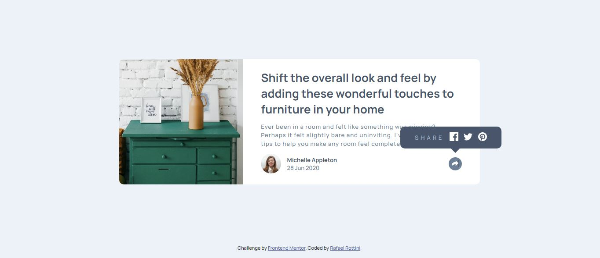
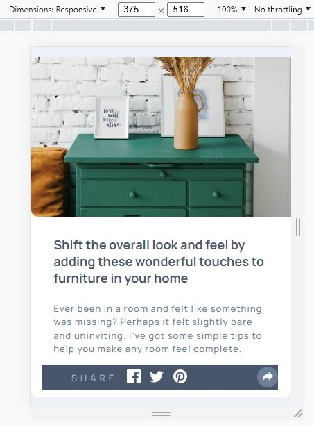

# Frontend Mentor - Article preview component

## Welcome! 👋

### The challenge

- Build out the project to the designs provided basic understanding of HTML, CSS and JavaScript.**

### Screenshot

### Screenshot

### Links

- Live Site URL: [github-pages](https://rottini.github.io/article-preview-component-master/)

## My process

### Built with

- HTML5 
- CSS custom properties
- JavaScript 

## Author

- Website - [Rafael](https://github.com/rottini)
- Frontend Mentor - [rottini](https://github.com/rottini/article-preview-component-master)